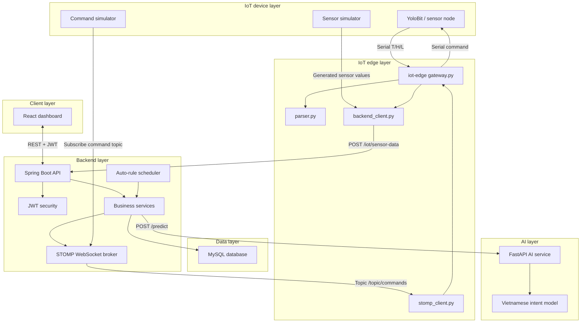
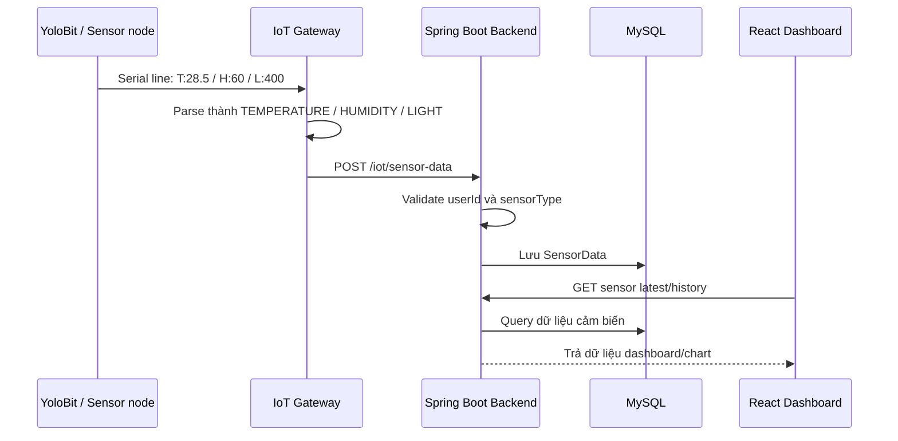
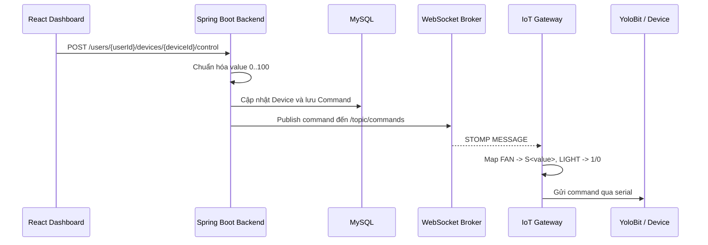
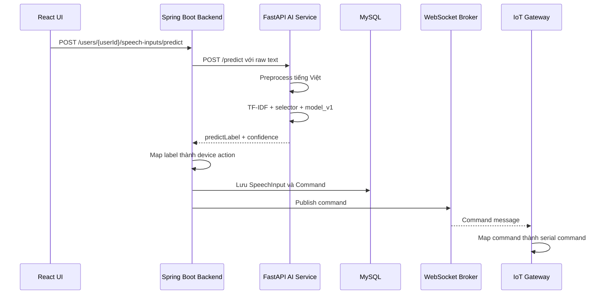
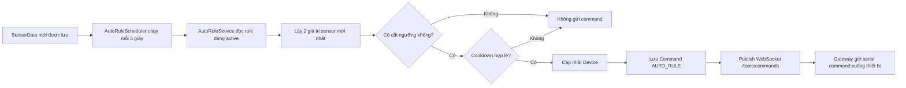

# Smart Study Room

Smart Study Room là hệ thống phòng học thông minh tích hợp IoT, backend web service, dashboard thời gian thực và AI nhận diện ý định điều khiển thiết bị bằng tiếng Việt. Dự án hướng tới một mô hình học tập có thể giám sát điều kiện phòng học, điều khiển thiết bị từ xa, hỗ trợ điều khiển bằng giọng nói và tự động hóa theo luật cảm biến.

## Thông tin học phần

| Thông tin | Nội dung |
|---|---|
| Trường | Trường Đại học Bách Khoa - Đại học Quốc gia Thành phố Hồ Chí Minh |
| Khoa | Khoa Khoa học và Kỹ thuật Máy tính |
| Môn học | Đồ án Đa ngành - hướng Trí tuệ Nhân tạo (CO3107) |
| Giảng viên hướng dẫn | CN. Tôn Huỳnh Long |
| Học kỳ | Học kỳ 252 năm học 2025-2026 |

## Thành viên nhóm

| Họ và tên | Mã số sinh viên | GitHub |
|---|---:|---|
| Bùi Nhật Quí | 2312864 | [@buinhatqui](https://github.com/buinhatqui) |
| Nguyễn Tấn Phúc | 2312703 | [@ngTanPhuc](https://github.com/ngTanPhuc) |
| Huỳnh Duy Chương | 2310363 | [@DuyChuong3011](https://github.com/DuyChuong3011) |
| Trần Kiến Quốc | 2312878 | [@KienQuoc52withVeolaohtihn](https://github.com/KienQuoc52withVeolaohtihn) |
| Đặng Thị Thúy Vi | 2313877 | [@ThuyZii](https://github.com/ThuyZii) |
| Trần Anh Tài | 2252726 | [@taitrn](https://github.com/taitrn) |

## Mục lục

- [Ý tưởng dự án](#ý-tưởng-dự-án)
- [Tính năng chính](#tính-năng-chính)
- [Kiến trúc tổng quan](#kiến-trúc-tổng-quan)
- [Workflow hệ thống](#workflow-hệ-thống)
- [Cấu trúc mã nguồn](#cấu-trúc-mã-nguồn)
- [Công nghệ sử dụng](#công-nghệ-sử-dụng)
- [Hướng dẫn chạy local](#hướng-dẫn-chạy-local)
- [IoT gateway và simulator](#iot-gateway-và-simulator)
- [API chính](#api-chính)
- [Biến môi trường](#biến-môi-trường)
- [Kiểm thử](#kiểm-thử)
- [Tài liệu liên quan](#tài-liệu-liên-quan)

## Ý tưởng dự án

Trong môi trường phòng học, các yếu tố như nhiệt độ, độ ẩm, ánh sáng và trạng thái thiết bị có thể ảnh hưởng trực tiếp đến trải nghiệm học tập. Thay vì chỉ điều khiển thủ công, hệ thống Smart Study Room xây dựng một mô hình quản lý tập trung gồm thiết bị IoT, web dashboard và dịch vụ AI.

Mục tiêu của hệ thống:

- Theo dõi dữ liệu cảm biến trong phòng học theo thời gian gần thực.
- Điều khiển thiết bị như đèn và quạt từ giao diện web.
- Ghi lại lịch sử cảm biến, lịch sử lệnh điều khiển và lịch sử lệnh giọng nói.
- Nhận diện lệnh tiếng Việt để chuyển thành hành động điều khiển thiết bị.
- Tự động hóa thiết bị bằng các luật dựa trên ngưỡng cảm biến.
- Tách hệ thống thành nhiều service để dễ phát triển, kiểm thử và mở rộng.

Ví dụ sử dụng:

- Khi ánh sáng thấp hơn ngưỡng cấu hình, hệ thống có thể tự bật đèn.
- Khi nhiệt độ cao hơn ngưỡng cấu hình, hệ thống có thể tự bật quạt.
- Người dùng có thể nói hoặc nhập câu như `bật quạt`, `tắt đèn`, sau đó AI service phân loại ý định và backend gửi lệnh xuống thiết bị.

## Tính năng chính

### Người dùng

- Đăng ký, đăng nhập, đăng xuất.
- Xác thực bằng JWT.
- Xem và cập nhật thông tin cá nhân.
- Phân quyền người dùng và quản trị viên.

### Cảm biến

- Nhận dữ liệu `TEMPERATURE`, `HUMIDITY`, `LIGHT` từ IoT gateway.
- Lưu dữ liệu cảm biến vào MySQL.
- Hiển thị dữ liệu mới nhất trên dashboard.
- Xem lịch sử và biểu đồ cảm biến.
- Xóa lịch sử cảm biến theo phạm vi thời gian.

### Thiết bị

- Quản lý trạng thái thiết bị theo từng user.
- Điều khiển đèn và quạt từ frontend.
- Chuẩn hóa mức điều khiển thiết bị về khoảng `0..100`.
- Gửi lệnh điều khiển xuống gateway qua WebSocket STOMP.

### Điều khiển bằng giọng nói

- Frontend gửi nội dung speech/text lên backend.
- Backend gọi AI service để dự đoán intent.
- AI service trả về label như `TURN_ON_FAN`, `TURN_OFF_LIGHT`.
- Backend ánh xạ label thành hành động điều khiển thiết bị.
- Hệ thống lưu lịch sử speech input và command tương ứng.

### Auto rules

- Người dùng tạo luật tự động dựa trên sensor, operator, threshold và thiết bị đích.
- Backend scheduler kiểm tra luật định kỳ.
- Luật chỉ kích hoạt khi dữ liệu cảm biến vượt/cắt ngưỡng hợp lệ.
- Có cooldown để hạn chế việc gửi lệnh lặp liên tục.

### Admin

- Quản lý danh sách người dùng.
- Xem thông tin người dùng.
- Cập nhật hoặc xóa người dùng khi có quyền phù hợp.

## Kiến trúc tổng quan



## Workflow hệ thống

### 1. Luồng dữ liệu cảm biến



### 2. Luồng điều khiển thiết bị thủ công



### 3. Luồng điều khiển bằng AI voice command



### 4. Luồng auto rule



## Cấu trúc mã nguồn

```text
.
|-- README.md
|-- CODEBASE.md
|-- pom.xml
|-- backend/
|   |-- pom.xml
|   |-- .env.example
|   |-- mvnw
|   |-- mvnw.cmd
|   `-- src/
|       |-- main/java/com/aiot/backend/
|       |   |-- BackendApplication.java
|       |   |-- client/
|       |   |-- configuration/
|       |   |-- controller/
|       |   |-- dto/
|       |   |-- entity/
|       |   |-- enums/
|       |   |-- exception/
|       |   |-- mapper/
|       |   |-- repository/
|       |   `-- service/
|       |-- main/resources/application.yaml
|       `-- test/java/com/aiot/backend/
|-- frontend/
|   |-- package.json
|   |-- package-lock.json
|   |-- index.html
|   |-- vite.config.ts
|   |-- tsconfig.json
|   |-- tailwind.config.js
|   |-- public/
|   `-- src/
|       |-- app/
|       |-- components/
|       |-- contexts/
|       |-- features/
|       |-- hooks/
|       |-- pages/
|       |-- services/
|       |-- shared/
|       |-- types/
|       `-- utils/
|-- ai-service/
|   |-- service.py
|   |-- requirements.txt
|   |-- .env.example
|   |-- app/
|   |-- data/
|   |-- models/
|   |-- tests/
|   `-- nlp_model.ipynb
|-- iot-edge/
|   |-- gateway.py
|   |-- gateway_old.py
|   |-- sensor_node.py
|   |-- test_sensor_flow.py
|   |-- test_device_control_flow.py
|   |-- .env.example
|   |-- app/
|   `-- tests/
|-- docs/
|-- infra/
`-- scripts/
```

### Vai trò từng module

| Thư mục | Vai trò |
|---|---|
| `backend/` | REST API, authentication, persistence, WebSocket, auto-rule scheduler, device/sensor/speech business logic |
| `frontend/` | Giao diện React, dashboard, chart, form login/register, điều khiển thiết bị, rule management, admin page |
| `ai-service/` | Service AI phân loại ý định điều khiển thiết bị từ tiếng Việt |
| `iot-edge/` | Gateway đọc serial từ YoloBit, gửi sensor lên backend và nhận command qua WebSocket |
| `infra/` | Hạ tầng local, hiện có Docker Compose cho MySQL |
| `docs/` | Tài liệu chi tiết về setup, API, env và kiến trúc |
| `scripts/` | Script PowerShell hỗ trợ chạy dev, test và clean |

### Backend package map

| Package | Nội dung |
|---|---|
| `configuration/` | Security, CORS, JWT decoder, WebSocket config, init data, AI service properties |
| `controller/` | REST controllers cho auth, users, sensors, devices, commands, speech, auto rules |
| `service/` | Business logic chính |
| `repository/` | Spring Data JPA repositories |
| `entity/` | Entity ánh xạ database |
| `dto/` | Request/response DTO và IoT message contract |
| `mapper/` | MapStruct mappers |
| `enums/` | Enum loại sensor, device, command, role, operator |
| `exception/` | Error code và global exception handler |
| `client/` | Client gọi sang AI service |

### Frontend package map

| Thư mục | Nội dung |
|---|---|
| `src/app/` | App root, router, provider |
| `src/pages/` | Các màn hình chính |
| `src/components/` | Component dùng lại |
| `src/contexts/` | Auth context và theme context |
| `src/features/` | API/model theo từng domain: auth, devices, sensors, speech, history, auto rules, admin |
| `src/shared/api/` | Axios client, backend types, mappers |
| `src/hooks/` | Hook realtime feed và voice control |
| `src/services/` | Compatibility API layer và legacy Adafruit API |
| `src/types/` | Shared TypeScript types |
| `src/utils/` | Constants và helper |

## Công nghệ sử dụng

| Lớp | Công nghệ |
|---|---|
| Frontend | React 18, Vite 7, TypeScript, Tailwind CSS, Axios, TanStack React Query, React Router, Chart.js, Lucide React |
| Backend | Java 19, Spring Boot 4, Spring Web MVC, Spring Security, Spring Data JPA, WebSocket STOMP, WebClient, Lombok, MapStruct |
| Database | MySQL 8 |
| AI Service | Python 3.11+, FastAPI, Uvicorn, scikit-learn, joblib, underthesea |
| IoT Edge | Python, pyserial, requests, websocket-client |
| DevOps local | Docker Compose, PowerShell scripts |

## Hướng dẫn chạy local

### 1. Yêu cầu môi trường

- Java JDK đã cấu hình `JAVA_HOME`.
- Maven hoặc Maven Wrapper.
- Node.js và npm.
- Python 3.11+.
- MySQL 8+ hoặc Docker.
- Thiết bị YoloBit nếu muốn test phần gateway thật.

### 2. Clone project

```powershell
git clone <repository-url>
cd SmartStudyRoom
```

### 3. Tạo file môi trường

```powershell
Copy-Item backend\.env.example backend\.env
Copy-Item frontend\.env.example frontend\.env
Copy-Item ai-service\.env.example ai-service\.env
Copy-Item iot-edge\.env.example iot-edge\.env
```

### 4. Khởi động MySQL local

Có thể tự tạo database:

```sql
CREATE DATABASE smart_study_room;
```

Hoặc chạy MySQL bằng Docker Compose:

```powershell
docker compose -f infra\docker-compose.local.yml up -d mysql
```

Compose local dùng port host `3307`, vì vậy nếu dùng Docker Compose, cấu hình backend nên trỏ về:

```properties
SPRING_DATASOURCE_URL=jdbc:mysql://localhost:3307/smart_study_room
SPRING_DATASOURCE_USERNAME=root
SPRING_DATASOURCE_PASSWORD=smart_room_local_password
```

### 5. Chạy backend

```powershell
cd backend
mvn spring-boot:run
```

Backend mặc định chạy tại:

```text
http://localhost:8080
```

### 6. Chạy AI service

```powershell
cd ai-service
python -m venv .venv
.\.venv\Scripts\activate
pip install -r requirements.txt
uvicorn service:app --host 0.0.0.0 --port 8000
```

AI service mặc định chạy tại:

```text
http://localhost:8000
```

### 7. Chạy frontend

```powershell
cd frontend
npm install
npm run dev
```

Frontend Vite thường chạy tại:

```text
http://localhost:3000
```

Nếu Vite chọn port khác vì `3000` đang bận, xem URL được in trong terminal.

## IoT gateway và simulator

### Chạy gateway với YoloBit thật

`iot-edge/gateway.py` dùng khi có thiết bị thật kết nối qua serial. Script này đọc dữ liệu cảm biến từ serial, gửi lên backend, đồng thời lắng nghe command từ backend qua WebSocket để gửi lại xuống thiết bị.

```powershell
$env:SMART_ROOM_USER_ID="c7ab5c64-cee4-4ef6-9b2e-1f71824c0920"
$env:SMART_ROOM_SERIAL_PORT="COM3"
$env:SMART_ROOM_BAUDRATE="115200"
$env:SMART_ROOM_BACKEND_URL="http://localhost:8080"
$env:SMART_ROOM_WS_URL="ws://localhost:8080/ws"
python iot-edge\gateway.py
```

YoloBit cần gửi serial line theo format:

```text
T:28.5
H:60
L:400
```

Gateway map dữ liệu thành:

```text
T:28.5 -> TEMPERATURE = 28.5
H:60   -> HUMIDITY = 60
L:400  -> LIGHT = 400
```

Khi backend gửi command, gateway map xuống serial:

```text
FAN value   -> S<value>
LIGHT > 0   -> 1
LIGHT <= 0  -> 0
```

### Chạy sensor simulator

Dùng khi chưa có thiết bị thật. Script random dữ liệu `TEMPERATURE`, `HUMIDITY`, `LIGHT` và gửi lên backend định kỳ.

```powershell
$env:SMART_ROOM_USER_ID="c7ab5c64-cee4-4ef6-9b2e-1f71824c0920"
$env:SMART_ROOM_BACKEND_URL="http://localhost:8080"
$env:SMART_ROOM_SENSOR_INTERVAL="5"
python iot-edge\test_sensor_flow.py
```

Output mẫu:

```text
Sending random sensor data to http://localhost:8080/iot/sensor-data every 5s
sent TEMPERATURE: 28.31
sent HUMIDITY: 64.2
sent LIGHT: 78.5
```

### Chạy command simulator

Dùng khi chưa có thiết bị thật nhưng muốn test luồng điều khiển từ backend xuống gateway.

```powershell
$env:SMART_ROOM_USER_ID="c7ab5c64-cee4-4ef6-9b2e-1f71824c0920"
$env:SMART_ROOM_WS_URL="ws://localhost:8080/ws"
python iot-edge\test_device_control_flow.py
```

Sau đó điều khiển đèn hoặc quạt từ frontend. Terminal sẽ in dạng:

```text
received command: FAN -> 66
device states | FAN=66% | LIGHT=OFF
```

### Chạy bằng helper script

```powershell
.\scripts\dev.ps1 -Service backend
.\scripts\dev.ps1 -Service frontend
.\scripts\dev.ps1 -Service ai
.\scripts\dev.ps1 -Service sensor
.\scripts\dev.ps1 -Service commands
```

## API chính

### Auth

| Method | Endpoint | Mô tả |
|---|---|---|
| `POST` | `/auth/register` | Đăng ký |
| `POST` | `/auth/login` | Đăng nhập |
| `POST` | `/auth/logout` | Đăng xuất |
| `POST` | `/auth/verify` | Kiểm tra token |
| `POST` | `/auth/refresh` | Làm mới token |

### User data

| Method | Endpoint | Mô tả |
|---|---|---|
| `GET` | `/users/{userId}/sensors` | Lấy danh sách sensor |
| `GET` | `/users/{userId}/sensors/{sensorId}/data` | Lấy lịch sử sensor |
| `GET` | `/users/{userId}/devices` | Lấy danh sách thiết bị |
| `POST` | `/users/{userId}/devices/{deviceId}/control` | Điều khiển thiết bị |
| `GET` | `/users/{userId}/commands` | Lấy lịch sử command |
| `POST` | `/users/{userId}/speech-inputs/predict` | Xử lý lệnh giọng nói |
| `GET` | `/users/{userId}/auto-rules` | Lấy danh sách auto rules |

### IoT

| Method | Endpoint | Mô tả |
|---|---|---|
| `POST` | `/iot/sensor-data` | Gateway gửi dữ liệu sensor |
| WebSocket | `/ws` | STOMP endpoint |
| Topic | `/topic/commands` | Backend publish command xuống gateway |

## Biến môi trường

### Backend

| Biến | Mô tả |
|---|---|
| `SERVER_PORT` | Port backend, mặc định `8080` |
| `SPRING_DATASOURCE_URL` | JDBC URL MySQL |
| `SPRING_DATASOURCE_USERNAME` | Username database |
| `SPRING_DATASOURCE_PASSWORD` | Password database |
| `SPRING_JPA_HIBERNATE_DDL_AUTO` | Chế độ Hibernate DDL, local mặc định `update` |
| `JWT_SIGNER_KEY` | Secret ký JWT |
| `JWT_VALID_DURATION` | Thời hạn access token, đơn vị giây |
| `JWT_REFRESHABLE_DURATION` | Thời gian cho phép refresh token, đơn vị giây |
| `AI_SERVICE_BASE_URL` | Base URL của AI service |
| `AI_SERVICE_TIMEOUT_SECONDS` | Timeout khi gọi AI service |
| `CORS_ALLOWED_ORIGINS` | Danh sách origin frontend được phép gọi API |

### Frontend

| Biến | Mô tả |
|---|---|
| `VITE_API_BASE_URL` | Backend API URL |
| `VITE_DATA_PROVIDER` | Data provider, mặc định `backend`; có thể dùng `adafruit` cho legacy mode |
| `VITE_AIO_USERNAME` | Username Adafruit IO, chỉ dùng legacy mode |
| `VITE_AIO_KEY` | Key Adafruit IO, chỉ dùng legacy mode |

### AI service

| Biến | Mô tả |
|---|---|
| `AI_MODEL_DIR` | Thư mục chứa model |
| `AI_MIN_CONFIDENCE` | Ngưỡng confidence tối thiểu để nhận intent |

### IoT edge

| Biến | Mô tả |
|---|---|
| `SMART_ROOM_USER_ID` | User ID dùng để map sensor/device |
| `SMART_ROOM_SERIAL_PORT` | Cổng serial, ví dụ `COM3` |
| `SMART_ROOM_BAUDRATE` | Baudrate serial |
| `SMART_ROOM_BACKEND_URL` | Backend REST base URL |
| `SMART_ROOM_WS_URL` | Backend WebSocket URL |
| `SMART_ROOM_BACKEND_TOKEN` | Bearer token tùy chọn |
| `SMART_ROOM_SENSOR_INTERVAL` | Chu kỳ gửi sensor của simulator |
| `SMART_ROOM_DEBUG_SERIAL` | Bật/tắt log serial debug |

## Kiểm thử

Chạy toàn bộ kiểm tra nhanh:

```powershell
.\scripts\test.ps1
```

Script này chạy:

- Backend: `mvn test`
- Frontend: `npm run build`
- AI service: `python -m py_compile` và `python -m unittest discover -s tests`
- IoT edge: `python -m py_compile` và `python -m unittest discover -s tests`

Chạy riêng từng phần:

```powershell
cd backend
mvn test
```

```powershell
cd frontend
npm run build
```

```powershell
cd ai-service
python -m unittest discover -s tests
```

```powershell
cd iot-edge
python -m unittest discover -s tests
```

## Quy ước phát triển

- Thư mục frontend chính là `frontend/`; không tách thêm `front-end/` nếu không có app riêng.
- Không commit `node_modules/`, `dist/`, `target/`, `.venv/`, `__pycache__/`.
- Giữ request/response DTO backend ổn định vì frontend map trực tiếp từ các contract này.
- Với thiết bị thật, ưu tiên test `iot-edge/gateway.py`; `gateway_old.py` chỉ là bản tham chiếu cũ.
- Khi deploy, phải thay `JWT_SIGNER_KEY` và mật khẩu database bằng giá trị mới.

## Tài liệu liên quan

- Bộ tài liệu kỹ thuật: `docs/README.md`
- Tổng quan codebase: `CODEBASE.md`
- Kiến trúc: `docs/architecture.md`
- Setup chi tiết: `docs/setup.md`
- Biến môi trường: `docs/env.md`
- API chính: `docs/api.md`
- IoT edge: `docs/iot.md`
- AI service: `docs/ai-service.md`
- Development guide: `docs/development.md`

## Ghi chú bảo mật

Secret cũ trong cấu hình local đã được thay bằng biến môi trường. Khi chạy thật, hãy dùng `JWT_SIGNER_KEY` và mật khẩu database mới; không tái sử dụng giá trị đã từng nằm trong repository.

Dự án này phục vụ mục đích học tập nên signer key dưới đây được công khai để mọi người có thể chạy local giống nhau:

```text
JWT_SIGNER_KEY=5536d9c7d3a5520637881025e26519cce4c8a3adb105f10fbe789a6bc17e42e9
```

Key này chỉ dùng cho demo/local learning, không dùng cho production hoặc dữ liệu thật.

## Chạy bằng `run.py`

Project có helper `run.py` ở thư mục gốc để gom các thao tác thường dùng khi phát triển: chuẩn bị môi trường, chạy service, bật/tắt database, chạy test, dọn file sinh ra và kiểm tra tool local. Helper này phù hợp khi làm việc trên Windows terminal vì các lệnh frontend dùng `npm.cmd` để tránh lỗi PowerShell execution policy.

### Mục đích

`run.py` giúp tránh phải nhớ nhiều lệnh riêng cho từng module:

- Backend: Spring Boot trong `backend/`.
- Frontend: React/Vite trong `frontend/`.
- AI service: FastAPI trong `ai-service/`.
- IoT edge: gateway, sensor simulator và command simulator trong `iot-edge/`.
- Database local: MySQL bằng Docker Compose trong `infra/docker-compose.local.yml`.

### Mở menu tương tác

Nếu muốn chọn lệnh bằng menu:

```powershell
python run.py
```

Menu gồm các nhóm:

| Nhóm | Chức năng |
|---|---|
| `Setup` | Tạo `.env`, cài dependency Node/Python, bật MySQL |
| `Dev` | Chạy backend, frontend, AI service, gateway hoặc simulator |
| `Database` | Quản lý MySQL local bằng Docker Compose |
| `Test` | Chạy kiểm tra backend, frontend, AI service, IoT edge |
| `Clean` | Xóa generated files/folders |
| `Doctor` | Kiểm tra tool local trước khi chạy project |

### Cú pháp lệnh nhanh

Ngoài menu, có thể gọi trực tiếp:

```powershell
python run.py setup env
python run.py setup all
python run.py dev backend
python run.py dev frontend
python run.py dev ai
python run.py dev all
python run.py db up
python run.py db down
python run.py test ai
python run.py test iot
python run.py test all
python run.py clean
python run.py doctor
```

### Nhóm `setup`

Nhóm `setup` dùng khi chuẩn bị môi trường local, đặc biệt ở lần chạy đầu tiên.

| Lệnh | Tác dụng |
|---|---|
| `python run.py setup env` | Copy các file `.env.example` sang `.env` nếu file `.env` chưa tồn tại |
| `python run.py setup frontend` | Chạy `npm.cmd install` trong `frontend/` |
| `python run.py setup ai` | Tạo `ai-service/.venv` và cài `ai-service/requirements.txt` |
| `python run.py setup iot` | Tạo `iot-edge/.venv` và cài `iot-edge/requirements.txt` |
| `python run.py setup db` | Bật MySQL local bằng Docker Compose |
| `python run.py setup all` | Chạy lần lượt `env`, `frontend`, `ai`, `iot`, `db` |

`setup env` không ghi đè file `.env` đã tồn tại. Nếu bạn đã chỉnh database URL, token, port hoặc secret trong `.env`, các giá trị đó sẽ được giữ nguyên.

### Nhóm `dev`

Nhóm `dev` dùng để chạy từng phần của hệ thống.

| Lệnh | Tác dụng |
|---|---|
| `python run.py dev backend` | Chạy Spring Boot backend trong `backend/` |
| `python run.py dev frontend` | Chạy Vite dev server trong `frontend/` |
| `python run.py dev ai` | Chạy AI service bằng `python -m uvicorn service:app --host 0.0.0.0 --port 8000` |
| `python run.py dev gateway` | Chạy gateway thật bằng `iot-edge/gateway.py` |
| `python run.py dev sensor` | Chạy sensor simulator bằng `iot-edge/test_sensor_flow.py` |
| `python run.py dev commands` | Chạy command simulator bằng `iot-edge/test_device_control_flow.py` |
| `python run.py dev all` | Bật MySQL, rồi mở backend, frontend, AI service và sensor simulator ở các terminal riêng |

Khi chạy một service riêng lẻ, terminal hiện tại sẽ giữ process và hiển thị log. Khi chạy `dev all` trên Windows, `run.py` mở nhiều cửa sổ terminal riêng để có thể theo dõi log từng service và dừng từng service độc lập.

Thứ tự chạy thủ công được khuyến nghị:

```powershell
python run.py db up
python run.py dev backend
python run.py dev ai
python run.py dev frontend
python run.py dev sensor
```

### Nhóm `db`

Nhóm `db` quản lý MySQL local bằng file `infra/docker-compose.local.yml`.

| Lệnh | Tác dụng |
|---|---|
| `python run.py db up` | Bật MySQL local |
| `python run.py db down` | Tắt MySQL local |
| `python run.py db logs` | Xem log MySQL |
| `python run.py db ps` | Xem trạng thái container |

MySQL local trong compose expose ra host port `3307`, vì vậy nếu dùng database này thì backend `.env` nên trỏ tới:

```properties
SPRING_DATASOURCE_URL=jdbc:mysql://localhost:3307/smart_study_room
SPRING_DATASOURCE_USERNAME=root
SPRING_DATASOURCE_PASSWORD=smart_room_local_password
```

### Nhóm `test`

Nhóm `test` dùng để kiểm tra từng module hoặc toàn bộ project.

| Lệnh | Tác dụng |
|---|---|
| `python run.py test backend` | Chạy Maven test cho backend |
| `python run.py test frontend` | Chạy `npm.cmd run build` cho frontend |
| `python run.py test ai` | Compile Python và chạy unit test của AI service |
| `python run.py test iot` | Compile Python và chạy unit test của IoT edge |
| `python run.py test all` | Chạy lần lượt backend, frontend, AI service và IoT edge |

Trước khi bàn giao code hoặc commit, nên chạy:

```powershell
python run.py test all
```

Nếu backend test báo lỗi Java hoặc Maven, chạy `python run.py doctor` để kiểm tra `JAVA_HOME`, Java và Maven trước.

### Nhóm `clean`

Lệnh clean dùng để xóa file/folder sinh ra trong quá trình phát triển:

```powershell
python run.py clean
```

Mặc định lệnh này sẽ hỏi xác nhận trước khi xóa. Nếu chắc chắn muốn xóa ngay:

```powershell
python run.py clean --yes
```

Các mục có thể bị xóa gồm:

- `frontend/node_modules`
- `frontend/dist`
- `frontend/.vite`
- `backend/target`
- `ai-service/.venv`
- `iot-edge/.venv`
- `__pycache__`

`run.py` chỉ xóa các đường dẫn nằm trong workspace project để tránh xóa nhầm file bên ngoài.

### Nhóm `doctor`

Lệnh `doctor` kiểm tra nhanh môi trường local:

```powershell
python run.py doctor
```

Các tool được kiểm tra:

| Tool | Dùng cho |
|---|---|
| Python | Chạy `run.py`, AI service và IoT edge |
| Java/JAVA_HOME | Chạy backend Spring Boot |
| Maven hoặc Maven Wrapper | Build/test backend |
| Node.js | Chạy frontend |
| npm.cmd | Cài package và build frontend trên Windows |
| Docker | Chạy MySQL local |

Nếu một dòng báo `FAIL`, hãy sửa tool tương ứng trước khi chạy nhóm lệnh phụ thuộc vào nó. Ví dụ:

- Backend cần Java/JDK, `JAVA_HOME` và Maven.
- Frontend cần Node.js và npm.
- Database local cần Docker Desktop đang chạy.
- AI service và IoT edge cần Python 3.11+.

### Quy trình chạy lần đầu

Khi mới clone project hoặc mới reset môi trường:

```powershell
python run.py doctor
python run.py setup env
python run.py setup frontend
python run.py setup ai
python run.py setup iot
python run.py setup db
```

Sau đó chạy các service:

```powershell
python run.py dev all
```

Hoặc chạy từng phần nếu muốn kiểm soát log trong từng terminal riêng:

```powershell
python run.py db up
python run.py dev backend
python run.py dev ai
python run.py dev frontend
python run.py dev sensor
```

### Lỗi thường gặp

| Hiện tượng | Nguyên nhân thường gặp | Cách xử lý |
|---|---|---|
| `JAVA_HOME is not set` | Chưa cấu hình JDK | Cài JDK phù hợp và set `JAVA_HOME` |
| Maven không chạy được | Java/JDK hoặc `JAVA_HOME` sai | Chạy `python run.py doctor` và sửa Java trước |
| `npm.ps1 cannot be loaded` | PowerShell chặn script `.ps1` | Dùng `run.py` vì helper gọi `npm.cmd` |
| Backend không kết nối database | MySQL chưa chạy hoặc sai port/password | Chạy `python run.py db up` và kiểm tra `backend/.env` |
| AI service không chạy | Thiếu dependency Python | Chạy `python run.py setup ai` |
| IoT simulator lỗi import package | Thiếu dependency IoT edge | Chạy `python run.py setup iot` |
| Docker báo lỗi quyền/config | Docker Desktop chưa sẵn sàng hoặc user config bị chặn | Mở Docker Desktop, kiểm tra lại `docker --version` và `python run.py doctor` |

### Ghi chú quan trọng

- `setup env` chỉ tạo file `.env` còn thiếu từ `.env.example`, không ghi đè file đã tồn tại.
- `dev all` bật MySQL rồi mở backend, frontend, AI service và sensor simulator ở các terminal riêng trên Windows.
- `doctor` kiểm tra nhanh Python, Java/JAVA_HOME, Maven, Node, npm và Docker trước khi chạy project.
- `setup all` có thể tải dependencies qua npm, pip và Docker, nên cần internet nếu máy chưa có sẵn package/image.
- `clean --yes` xóa trực tiếp generated folders, chỉ dùng khi chắc chắn không cần giữ lại virtualenv hoặc `node_modules`.
