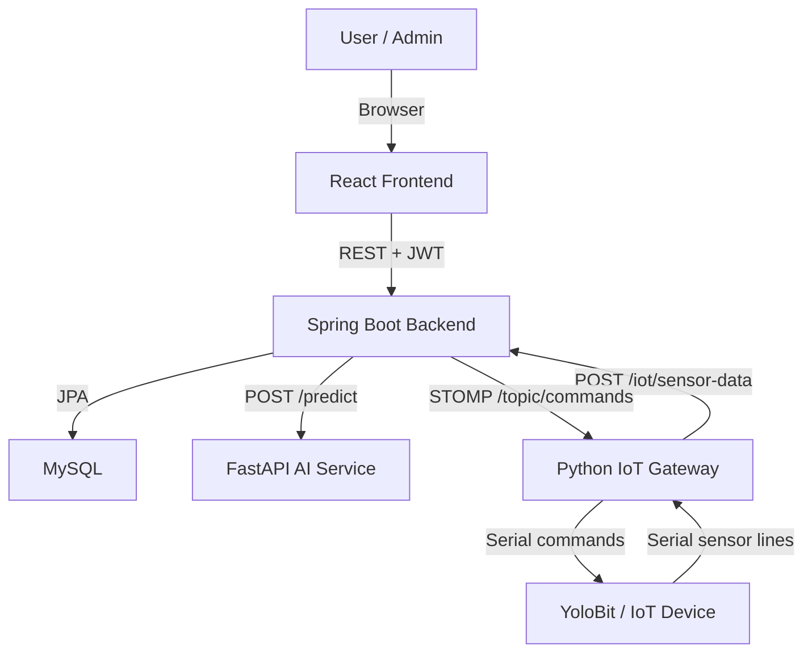

# Smart Study Room Documentation

Trang này là điểm vào chính cho bộ tài liệu kỹ thuật của Smart Study Room. Mục tiêu của tài liệu là giúp thành viên mới, giảng viên, reviewer hoặc người vận hành có thể hiểu nhanh kiến trúc, cách chạy, cách tích hợp và cách phát triển tiếp hệ thống.

## Documentation Map

| Tài liệu | Mục đích | Đối tượng chính |
|---|---|---|
| [Architecture](architecture.md) | Kiến trúc tổng thể, thành phần hệ thống, luồng dữ liệu, quyết định thiết kế | Developer, reviewer, maintainer |
| [Setup](setup.md) | Hướng dẫn cài đặt và chạy local từng service | Developer, tester |
| [Environment Variables](env.md) | Bảng cấu hình môi trường, default value, lưu ý bảo mật | Developer, deployer |
| [API Reference](api.md) | REST API, response envelope, request/response examples, WebSocket contract | Frontend/backend developer |
| [IoT Edge Guide](iot.md) | Serial protocol, gateway, simulator, WebSocket command flow | IoT developer, tester phần cứng |
| [AI Service Guide](ai-service.md) | FastAPI service, preprocessing, model artifacts, label mapping | AI/backend developer |
| [Development Guide](development.md) | Quy ước phát triển, test strategy, generated files, troubleshooting | Tất cả contributor |
| [Codebase Overview](../CODEBASE.md) | Bản đồ thư mục và codebase map chi tiết | Developer mới vào dự án |

## Project Summary

Smart Study Room là hệ thống phòng học thông minh gồm bốn phần chính:

- `frontend/`: React + Vite dashboard cho người dùng và admin.
- `backend/`: Spring Boot API xử lý auth, sensor, device, speech command, auto rule và WebSocket command.
- `ai-service/`: FastAPI service nhận diện intent điều khiển thiết bị từ tiếng Việt.
- `iot-edge/`: Python gateway đọc serial từ YoloBit, gửi sensor lên backend và nhận command từ backend qua STOMP WebSocket.

## System Context



## Quick Start

1. Copy environment files:

```powershell
Copy-Item backend\.env.example backend\.env
Copy-Item frontend\.env.example frontend\.env
Copy-Item ai-service\.env.example ai-service\.env
Copy-Item iot-edge\.env.example iot-edge\.env
```

2. Start MySQL:

```powershell
docker compose -f infra\docker-compose.local.yml up -d mysql
```

3. Run services in separate terminals:

```powershell
cd backend
mvn spring-boot:run
```

```powershell
cd ai-service
python -m venv .venv
.\.venv\Scripts\activate
pip install -r requirements.txt
uvicorn service:app --host 0.0.0.0 --port 8000
```

```powershell
cd frontend
npm install
npm run dev
```

4. Optional IoT simulator:

```powershell
$env:SMART_ROOM_USER_ID="c7ab5c64-cee4-4ef6-9b2e-1f71824c0920"
python iot-edge\test_sensor_flow.py
```

## Runtime URLs

| Service | Default URL | Notes |
|---|---|---|
| Frontend | `http://localhost:3000` | Vite dev server |
| Backend | `http://localhost:8080` | Spring Boot REST API |
| Backend WebSocket | `ws://localhost:8080/ws` | STOMP endpoint |
| AI Service | `http://localhost:8000` | FastAPI |
| MySQL | `localhost:3307` | Docker Compose host port |

## Contract Conventions

### REST response envelope

Backend REST responses use a shared envelope:

```json
{
  "code": 0,
  "message": "success",
  "timestamp": "2026-06-06T10:30:00",
  "result": {}
}
```

### Authentication

- Public endpoints: `POST /auth/register`, `POST /auth/login`, `POST /auth/verify`, `POST /auth/refresh`.
- Public IoT endpoints: `/iot/sensor-data`, `/sensor-data`, `/sensors/sensor-data`, `/ws/**`.
- Other backend endpoints require a JWT bearer token.

### Generated artifacts

These folders are generated locally and should not be committed:

- `frontend/node_modules/`
- `frontend/dist/`
- `backend/target/`
- `ai-service/.venv/`
- `iot-edge/__pycache__/`

## Recommended Reading Order

For a new contributor:

1. Read this page.
2. Read [Architecture](architecture.md).
3. Follow [Setup](setup.md).
4. Use [API Reference](api.md) while integrating frontend/backend.
5. Use [IoT Edge Guide](iot.md) when testing real hardware or simulator flows.
6. Use [Development Guide](development.md) before making larger changes.
