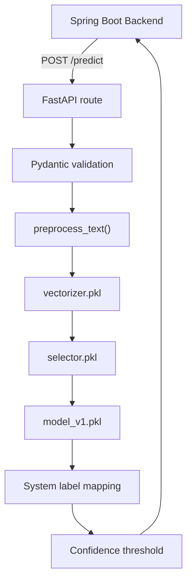
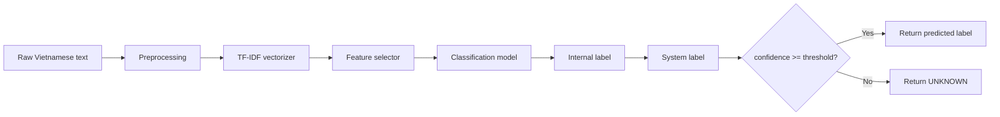

# AI Service Guide

Tài liệu này mô tả FastAPI AI service dùng để phân loại ý định điều khiển thiết bị từ câu tiếng Việt.

## 1. Scope

`ai-service/` nhận raw text từ backend, xử lý ngôn ngữ tiếng Việt, chạy pipeline model và trả về system label để backend quyết định hành động điều khiển thiết bị.

The service is intentionally small:

- No user/session state.
- No database dependency.
- Loads trained model artifacts at startup.
- Exposes simple health and prediction endpoints.

## 2. Files

| File | Responsibility |
|---|---|
| `ai-service/service.py` | Public import entrypoint for `uvicorn service:app` |
| `ai-service/app/main.py` | FastAPI app factory/module |
| `ai-service/app/routes.py` | `/health` and `/predict` routes |
| `ai-service/app/schemas.py` | Pydantic request/response models |
| `ai-service/app/config.py` | Model directory and confidence threshold |
| `ai-service/app/preprocessing.py` | Vietnamese text preprocessing |
| `ai-service/app/model.py` | Load model artifacts and run prediction |
| `ai-service/models/` | `vectorizer.pkl`, `selector.pkl`, `model_v1.pkl` |
| `ai-service/data/` | Raw datasets |
| `ai-service/tests/` | Unit tests for preprocessing |
| `ai-service/nlp_model.ipynb` | Notebook used for model work/training |

## 3. Runtime Architecture



## 4. API

### Health

```http
GET /health
```

Response:

```json
{
  "status": "ok"
}
```

### Predict

```http
POST /predict
Content-Type: application/json
```

Request:

```json
{
  "rawtext": "bật quạt"
}
```

`rawText` is also accepted as an alias:

```json
{
  "rawText": "bật đèn"
}
```

Response:

```json
{
  "predictLabel": "TURN_ON_FAN",
  "confidence": 0.93
}
```

## 5. Preprocessing Pipeline

The preprocessing pipeline prepares Vietnamese input for the trained classifier:

1. Lowercase input.
2. Collapse repeated whitespace.
3. Remove punctuation while preserving Vietnamese characters.
4. Normalize common slang variants.
5. Tokenize using `underthesea.word_tokenize`.

Examples of slang normalization:

| Input variant | Normalized |
|---|---|
| `ko`, `k`, `hok` | `khong` |
| `giùm`, `dum` | `giup` |

## 6. Model Pipeline



Artifacts:

| Artifact | Purpose |
|---|---|
| `models/vectorizer.pkl` | Converts processed text to TF-IDF features |
| `models/selector.pkl` | Selects trained feature subset |
| `models/model_v1.pkl` | Classifies intent |

## 7. Label Mapping

Current model label mapping:

| Model label | System label |
|---|---|
| `bat_quat` | `TURN_ON_FAN` |
| `tat_quat` | `TURN_OFF_FAN` |
| `bat_den` | `TURN_ON_LIGHT` |
| `tat_den` | `TURN_OFF_LIGHT` |
| Unknown/unsupported | `UNKNOWN` |

Backend also understands a wider set of possible speech labels for future extension, such as `FAN_ON`, `FAN_OFF`, `INCREASE_FAN`, `DECREASE_FAN`, `LIGHT_ON`, `LIGHT_OFF`.

## 8. Confidence Behavior

AI service uses `AI_MIN_CONFIDENCE`, default `0.7`.

If model confidence is below threshold:

```json
{
  "predictLabel": "UNKNOWN",
  "confidence": 0.42
}
```

Backend has its own speech confidence threshold as well. Low-confidence results are saved as speech history but do not execute device commands.

## 9. Running Locally

```powershell
cd ai-service
python -m venv .venv
.\.venv\Scripts\activate
pip install -r requirements.txt
uvicorn service:app --host 0.0.0.0 --port 8000
```

Health check:

```powershell
Invoke-RestMethod http://localhost:8000/health
```

Prediction check:

```powershell
Invoke-RestMethod `
  -Method Post `
  -Uri http://localhost:8000/predict `
  -ContentType "application/json" `
  -Body '{"rawtext":"tắt đèn"}'
```

## 10. Testing

```powershell
cd ai-service
python -m py_compile service.py app\*.py tests\*.py
python -m unittest discover -s tests
```

## 11. Model Update Checklist

When retraining or replacing model files:

1. Keep artifact names compatible or update `app/model.py`.
2. Verify `vectorizer.pkl`, `selector.pkl`, `model_v1.pkl` are generated together.
3. Confirm label names match `LABEL_MAPPING`.
4. Run preprocessing tests.
5. Run manual predictions for common commands:
   - `bật quạt`
   - `tắt quạt`
   - `bật đèn`
   - `tắt đèn`
6. Verify backend speech command flow still works.
7. Document dataset/model changes in commit message or release notes.

## 12. Troubleshooting

| Symptom | Likely cause | Fix |
|---|---|---|
| Service fails at startup | Missing model artifact | Check `AI_MODEL_DIR` and model files |
| Import error for `underthesea` | Dependencies not installed | Run `pip install -r requirements.txt` |
| Always returns `UNKNOWN` | Confidence threshold too high or model mismatch | Check `AI_MIN_CONFIDENCE`, test raw predictions |
| Backend speech timeout | AI service not running or slow | Check `AI_SERVICE_BASE_URL` and `AI_SERVICE_TIMEOUT_SECONDS` |
| Label not executed by backend | Unsupported system label | Update backend `SpeechInputService.parseIntent()` |

## 13. Related Documents

- [Architecture](architecture.md)
- [API Reference](api.md)
- [Setup Guide](setup.md)
- [Environment Variables](env.md)
