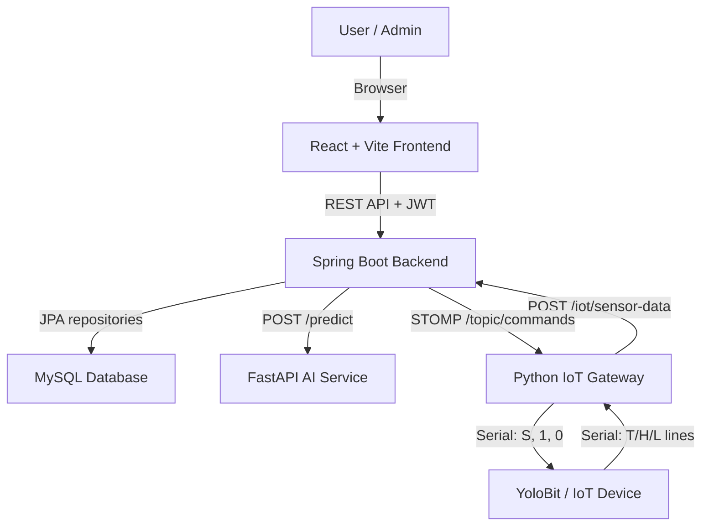
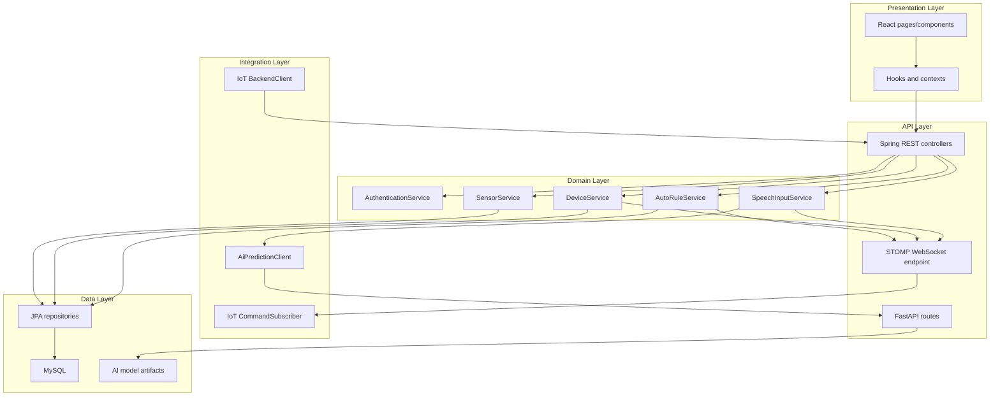
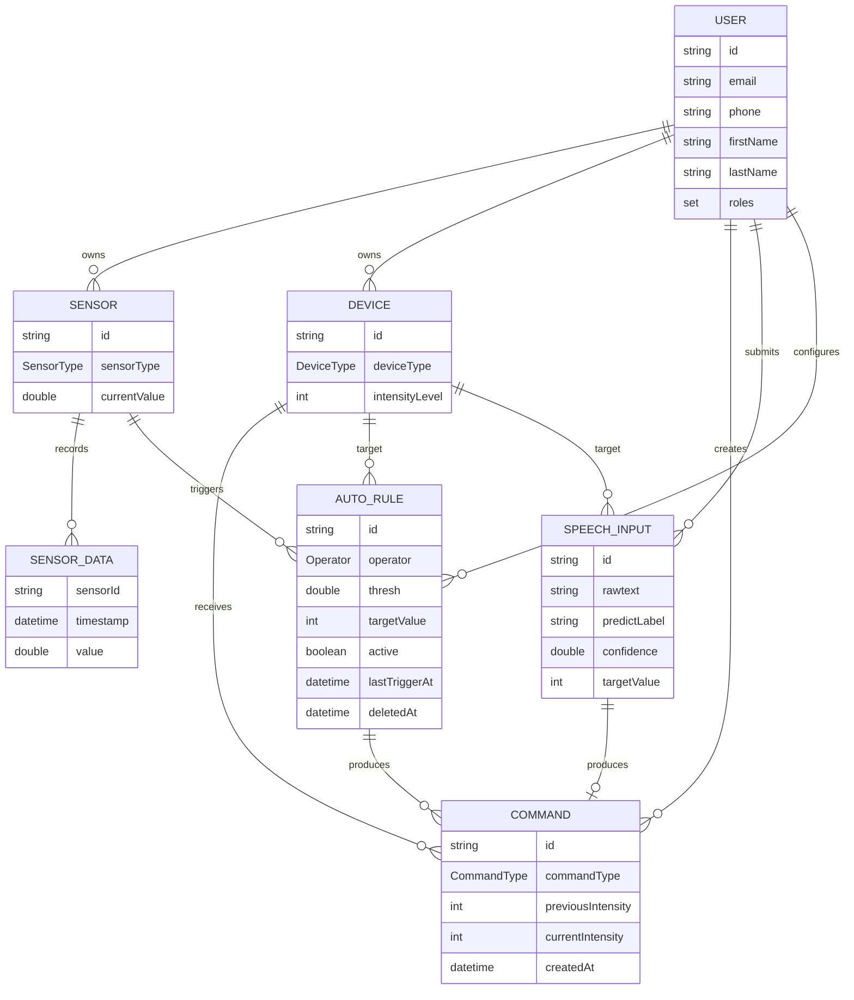
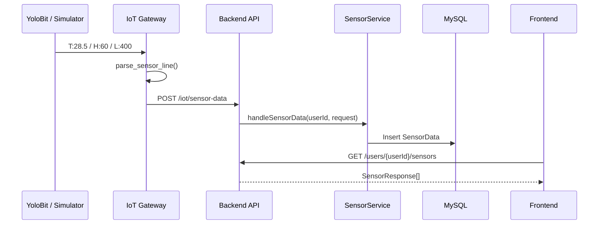
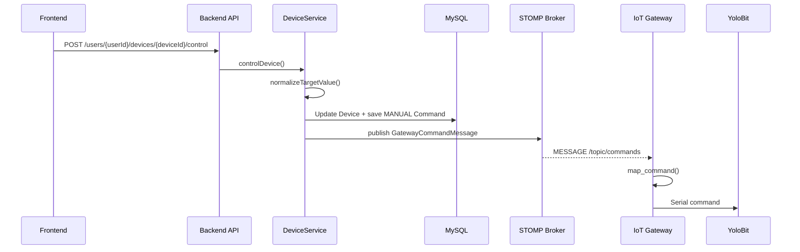
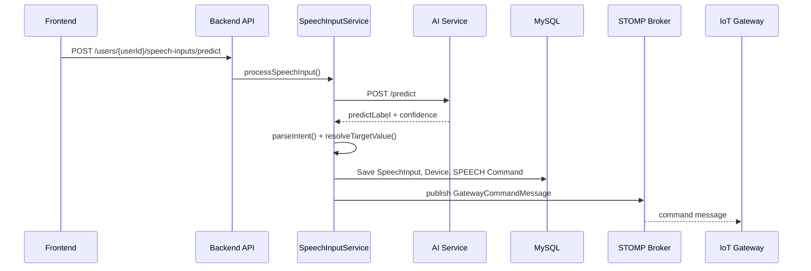
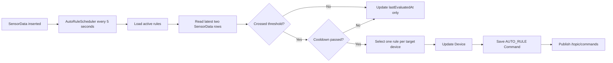

# Architecture - Smart Study Room

## 1. Purpose

Tài liệu này mô tả kiến trúc kỹ thuật của Smart Study Room ở mức hệ thống. Nội dung tập trung vào thành phần runtime, trách nhiệm từng service, luồng dữ liệu, contract tích hợp và các ràng buộc thiết kế quan trọng.

Smart Study Room được thiết kế như một hệ thống đa service phục vụ phòng học thông minh:

- IoT device/gateway thu thập dữ liệu cảm biến và nhận lệnh điều khiển.
- Backend xử lý nghiệp vụ, xác thực, lưu trữ, tự động hóa và publish command.
- Frontend cung cấp dashboard và thao tác người dùng.
- AI service phân loại ý định điều khiển thiết bị từ tiếng Việt.

## 2. Architecture Goals

| Goal | Ý nghĩa trong dự án |
|---|---|
| Modular | Tách frontend, backend, AI service và IoT edge để mỗi phần có thể phát triển/kiểm thử độc lập |
| Local-first | Có thể chạy toàn bộ hệ thống trên máy cá nhân với MySQL Docker Compose |
| Real-time control | Command từ backend được đẩy xuống gateway qua WebSocket STOMP |
| Hardware-friendly | Gateway dùng protocol serial đơn giản để dễ tích hợp YoloBit |
| Testable | Có simulator cho sensor flow và command flow khi chưa có thiết bị thật |
| Extendable | Có thể thêm sensor/device/intent/rule mà không thay đổi toàn bộ hệ thống |

## 3. High-Level Context



## 4. Runtime Components

### Frontend

| Area | Responsibility |
|---|---|
| Routing | Login, register, dashboard, sensor detail, chart, history, auto rules, profile, speech history, admin |
| API client | Axios wrapper, JWT injection, response unwrapping, 401 handling |
| State | React Context for auth/theme, React Query for server state |
| UI workflow | Device control, speech command submission, rule management, history browsing |
| Data provider | Default backend provider, optional legacy Adafruit mode |

### Backend

| Area | Responsibility |
|---|---|
| Authentication | Register, login, logout, JWT verify, token refresh |
| Authorization | JWT resource server and method-level ownership/admin checks |
| Sensor ingest | Receive sensor readings from gateway/simulator |
| Device control | Normalize target values, persist command history, publish gateway command |
| Speech control | Call AI service, map predicted label to device command |
| Auto rules | Evaluate threshold crossing and cooldown via scheduler |
| WebSocket | STOMP simple broker, command topic `/topic/commands` |
| Persistence | JPA entities and repositories backed by MySQL |

### AI Service

| Area | Responsibility |
|---|---|
| API | `GET /health`, `POST /predict` |
| Preprocessing | Normalize Vietnamese text, remove punctuation, normalize slang, tokenize |
| Prediction | TF-IDF vectorizer, feature selector, trained model |
| Label mapping | Convert model labels to system labels like `TURN_ON_FAN` |
| Confidence handling | Return `UNKNOWN` when confidence is below threshold |

### IoT Edge

| Area | Responsibility |
|---|---|
| Serial reader | Read sensor lines from YoloBit |
| Parser | Convert `T:`, `H:`, `L:` lines to backend sensor payloads |
| Backend client | POST sensor data to backend |
| STOMP client | Subscribe to `/topic/commands` |
| Command mapper | Convert backend command messages to serial commands |
| Simulator scripts | Generate sensor readings and emulate command receiver without hardware |

## 5. Layered View



## 6. Backend Domain Model



## 7. Main Workflows

### 7.1 Sensor Ingestion



### 7.2 Manual Device Control



### 7.3 Speech Command



### 7.4 Auto Rule



## 8. Integration Contracts

### REST

- Frontend uses Axios with `VITE_API_BASE_URL`.
- Authenticated requests carry `Authorization: Bearer <token>`.
- Backend wraps responses in `ApiResponse<T>`.

### WebSocket / STOMP

- Endpoint: `/ws`
- Broker prefix: `/topic`
- Application prefix: `/app`
- Gateway subscribes to `/topic/commands`.
- Command payload:

```json
{
  "userId": "c7ab5c64-cee4-4ef6-9b2e-1f71824c0920",
  "deviceType": "FAN",
  "value": 66
}
```

### Serial

Sensor input from device to gateway:

```text
T:<value> -> TEMPERATURE
H:<value> -> HUMIDITY
L:<value> -> LIGHT
```

Command output from gateway to device:

```text
FAN value   -> S<value>
LIGHT > 0   -> 1
LIGHT <= 0  -> 0
```

### AI service

Backend sends:

```json
{
  "rawtext": "bật quạt"
}
```

AI service returns:

```json
{
  "predictLabel": "TURN_ON_FAN",
  "confidence": 0.93
}
```

## 9. Security Model

| Concern | Current approach |
|---|---|
| Authentication | JWT bearer token generated by backend |
| Password storage | BCrypt password encoder |
| Token invalidation | Logout stores invalidated tokens |
| Authorization | Method-level checks allow admin or owner access |
| Public endpoints | Auth bootstrap endpoints, IoT ingest endpoint, WebSocket endpoint |
| CORS | Configured by `CORS_ALLOWED_ORIGINS` |
| Production secrets | Must be provided through environment variables |

Important limitation: `/iot/sensor-data` is public to support simple gateway/simulator integration. If the system is exposed outside a trusted network, use `SMART_ROOM_BACKEND_TOKEN`, network-level controls, or a dedicated gateway authentication strategy.

## 10. Operational Assumptions

- One user has default sensors for `TEMPERATURE`, `HUMIDITY`, and `LIGHT`.
- Device types currently supported by the gateway protocol are `FAN` and `LIGHT`.
- Fan accepts intensity from `0` to `100`.
- Light is treated as binary at gateway level: any value above `0` becomes `1`, otherwise `0`.
- Auto rules are evaluated periodically by scheduler, not synchronously during sensor ingestion.
- AI prediction is synchronous from backend to AI service; backend request latency depends on AI service availability.

## 11. Extension Points

| Extension | Required changes |
|---|---|
| Add a new sensor type | Add backend enum, seed sensor, parser mapping, frontend mapping/UI |
| Add a new device type | Add backend enum/entity seed, device control logic, gateway command mapping, frontend control component |
| Add a new speech intent | Retrain/update AI model labels, update backend intent mapping, update tests |
| Add gateway authentication | Require token on `/iot/sensor-data`, configure `SMART_ROOM_BACKEND_TOKEN`, update deployment docs |
| Add production deployment | Externalize secrets, use managed MySQL, set CORS domains, add process supervision |

## 12. Related Documents

- [Setup Guide](setup.md)
- [API Reference](api.md)
- [IoT Edge Guide](iot.md)
- [AI Service Guide](ai-service.md)
- [Environment Variables](env.md)
- [Development Guide](development.md)
