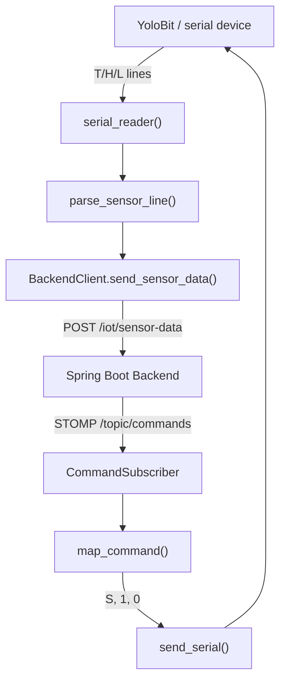

# IoT Edge Guide

Tài liệu này mô tả phần IoT edge của Smart Study Room: serial protocol với YoloBit, gateway runtime, simulator scripts và luồng command qua WebSocket.

## 1. Scope

`iot-edge/` chịu trách nhiệm kết nối giữa backend và thiết bị vật lý hoặc simulator:

- Đọc sensor data từ serial.
- Parse dữ liệu thành payload backend hiểu được.
- Gửi sensor data lên backend.
- Subscribe WebSocket topic để nhận command.
- Map command backend thành lệnh serial cho thiết bị.

## 2. Files

| File | Responsibility |
|---|---|
| `iot-edge/gateway.py` | Entrypoint cho gateway thật |
| `iot-edge/gateway_old.py` | Bản cũ tham chiếu, không nên dùng làm source chính |
| `iot-edge/test_sensor_flow.py` | Sensor simulator gửi dữ liệu random lên backend |
| `iot-edge/test_device_control_flow.py` | Command simulator nhận command từ WebSocket |
| `iot-edge/sensor_node.py` | Sensor-node helper |
| `iot-edge/app/config.py` | Cấu hình gateway từ environment variables |
| `iot-edge/app/parser.py` | Parse sensor line và map backend command |
| `iot-edge/app/backend_client.py` | HTTP client gửi sensor data |
| `iot-edge/app/stomp_client.py` | STOMP WebSocket subscriber |
| `iot-edge/tests/test_parser.py` | Unit tests cho parser/command mapping |

## 3. Gateway Architecture



## 4. Serial Sensor Protocol

The device sends one reading per line:

```text
T:28.5
H:60
L:400
```

Gateway mapping:

| Serial prefix | Backend `sensorType` | Example value |
|---|---|---:|
| `T:` | `TEMPERATURE` | `28.5` |
| `H:` | `HUMIDITY` | `60` |
| `L:` | `LIGHT` | `400` |

Backend payload:

```json
{
  "userId": "c7ab5c64-cee4-4ef6-9b2e-1f71824c0920",
  "sensorType": "TEMPERATURE",
  "value": 28.5
}
```

Invalid or unsupported lines are ignored. If `SMART_ROOM_DEBUG_SERIAL=1`, ignored lines are printed unless they are standard ack/ready messages.

## 5. Serial Command Protocol

Backend publishes command:

```json
{
  "userId": "c7ab5c64-cee4-4ef6-9b2e-1f71824c0920",
  "deviceType": "FAN",
  "value": 66
}
```

Gateway mapping:

| Backend command | Serial command | Meaning |
|---|---|---|
| `deviceType=FAN`, `value=66` | `S66` | Set fan level to 66 |
| `deviceType=LIGHT`, `value=100` | `1` | Turn light on |
| `deviceType=LIGHT`, `value=0` | `0` | Turn light off |

`map_command()` also filters by `userId`. If a command contains another `userId`, gateway ignores it.

## 6. Running Real Gateway

Install dependencies:

```powershell
cd iot-edge
python -m pip install -r requirements.txt
```

Set environment variables:

```powershell
$env:SMART_ROOM_USER_ID="c7ab5c64-cee4-4ef6-9b2e-1f71824c0920"
$env:SMART_ROOM_SERIAL_PORT="COM3"
$env:SMART_ROOM_BAUDRATE="115200"
$env:SMART_ROOM_BACKEND_URL="http://localhost:8080"
$env:SMART_ROOM_WS_URL="ws://localhost:8080/ws"
$env:SMART_ROOM_DEBUG_SERIAL="1"
```

Run:

```powershell
python iot-edge\gateway.py
```

Expected startup logs:

```text
Serial opened: COM3 @ 115200
Gateway started...
Backend URL: http://localhost:8080
WebSocket URL: ws://localhost:8080/ws
Subscribed to /topic/commands
```

## 7. Simulator Workflows

### Sensor simulator

```powershell
$env:SMART_ROOM_USER_ID="c7ab5c64-cee4-4ef6-9b2e-1f71824c0920"
$env:SMART_ROOM_BACKEND_URL="http://localhost:8080"
$env:SMART_ROOM_SENSOR_INTERVAL="5"
python iot-edge\test_sensor_flow.py
```

Use this to verify:

- Backend accepts `/iot/sensor-data`.
- Sensor data is stored in MySQL.
- Frontend dashboard/chart can read updated values.
- Auto rules can be triggered from incoming sensor data.

### Command simulator

```powershell
$env:SMART_ROOM_USER_ID="c7ab5c64-cee4-4ef6-9b2e-1f71824c0920"
$env:SMART_ROOM_WS_URL="ws://localhost:8080/ws"
python iot-edge\test_device_control_flow.py
```

Use this to verify:

- Backend publishes command to `/topic/commands`.
- Manual control creates command history.
- Speech control creates command history.
- Auto rules publish commands when triggered.

## 8. End-to-End IoT Test Matrix

| Test | Requires hardware | Expected result |
|---|---:|---|
| Sensor simulator -> backend | No | Backend stores random sensor readings |
| Command simulator <- backend | No | Simulator prints received fan/light commands |
| Gateway serial read | Yes | Gateway prints or sends parsed sensor data |
| Frontend manual control -> gateway | Yes or command simulator | Gateway prints `SEND:` and hardware reacts |
| AI speech command -> gateway | Yes or command simulator | Speech history + command history + gateway command |
| Auto rule -> gateway | Yes or simulators | Rule triggers only after threshold crossing |

## 9. Troubleshooting

### `Missing dependency: pyserial`

Install dependencies:

```powershell
cd iot-edge
python -m pip install -r requirements.txt
```

### `Invalid dependency: package 'serial' is installed instead of 'pyserial'`

Fix:

```powershell
python -m pip uninstall serial -y
python -m pip install pyserial
```

### Cannot open COM port

Check:

- Correct `SMART_ROOM_SERIAL_PORT`.
- Device is connected.
- No other application is using the COM port.
- Driver is installed.

### Sensor data rejected by backend

Check:

- `SMART_ROOM_USER_ID` exists in backend database.
- Backend is running.
- `SMART_ROOM_BACKEND_URL` is correct.
- If `userId` is omitted, request must be authenticated.

### Commands not reaching gateway

Check:

- Backend WebSocket URL: `SMART_ROOM_WS_URL=ws://localhost:8080/ws`.
- Gateway log includes `Subscribed to /topic/commands`.
- Backend command flow is actually creating a command.
- `userId` in command matches `SMART_ROOM_USER_ID`.

## 10. Extension Guidelines

### Add new sensor type

1. Add backend `SensorType`.
2. Seed/create sensor for users.
3. Extend `parse_sensor_line()` in `iot-edge/app/parser.py`.
4. Update frontend sensor mapping and UI.
5. Add parser tests.

### Add new device type

1. Add backend `DeviceType`.
2. Add device seed data.
3. Extend backend device normalization rules.
4. Extend gateway `map_command()`.
5. Update frontend control component.
6. Add tests for command mapping.

## 11. Related Documents

- [Architecture](architecture.md)
- [Setup Guide](setup.md)
- [API Reference](api.md)
- [Environment Variables](env.md)
