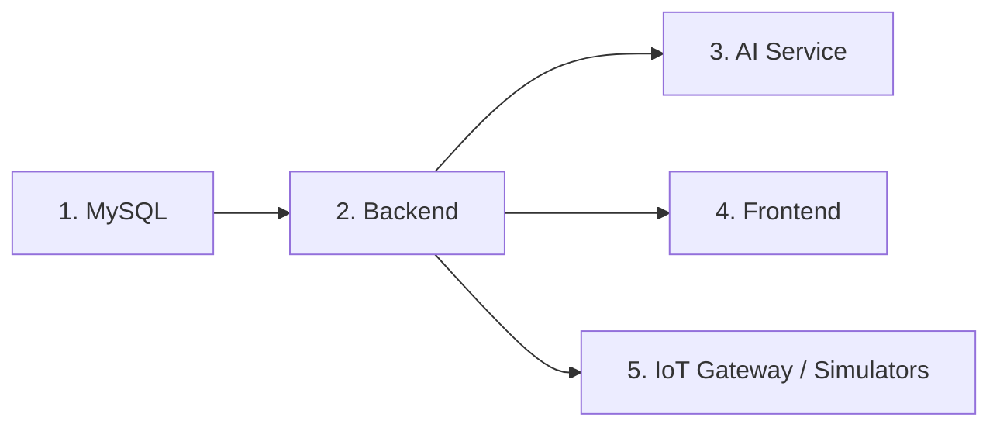

# Setup Guide

Tài liệu này hướng dẫn cài đặt và chạy Smart Study Room trên máy local. Các lệnh bên dưới ưu tiên PowerShell trên Windows vì workspace hiện tại dùng Windows path, nhưng có thể chuyển đổi tương đương sang shell khác.

## 1. Prerequisites

| Tool | Khuyến nghị | Dùng cho |
|---|---|---|
| Java JDK | Java 19 hoặc bản tương thích với `backend/pom.xml` | Spring Boot backend |
| Maven | Maven CLI hoặc Maven Wrapper | Build/test backend |
| Node.js + npm | Node.js LTS, npm đi kèm | React frontend |
| Python | Python 3.11+ | AI service và IoT edge |
| Docker | Docker Desktop | MySQL local bằng Docker Compose |
| MySQL client | Optional | Kiểm tra database thủ công |
| Serial driver | Theo thiết bị YoloBit | Gateway thật qua COM port |

Kiểm tra nhanh:

```powershell
java -version
mvn -version
node -v
npm -v
python --version
docker --version
```

## 2. Repository Layout

```text
SmartStudyRoom/
|-- backend/       Spring Boot API
|-- frontend/      React + Vite UI
|-- ai-service/    FastAPI intent classification service
|-- iot-edge/      Python serial gateway and simulators
|-- infra/         Local infrastructure
|-- scripts/       Developer scripts
`-- docs/          Project documentation
```

## 3. Environment Files

Copy sample environment files before running services:

```powershell
Copy-Item backend\.env.example backend\.env
Copy-Item frontend\.env.example frontend\.env
Copy-Item ai-service\.env.example ai-service\.env
Copy-Item iot-edge\.env.example iot-edge\.env
```

After copying, update secrets and local ports if needed. See [Environment Variables](env.md) for all supported values.

## 4. Start MySQL

### Option A: Docker Compose

```powershell
docker compose -f infra\docker-compose.local.yml up -d mysql
```

The compose file exposes MySQL on host port `3307`:

```text
localhost:3307 -> container:3306
```

Recommended backend `.env` for Docker Compose:

```properties
SPRING_DATASOURCE_URL=jdbc:mysql://localhost:3307/smart_study_room
SPRING_DATASOURCE_USERNAME=root
SPRING_DATASOURCE_PASSWORD=smart_room_local_password
```

Verify the container:

```powershell
docker ps
```

### Option B: Existing MySQL

Create the database manually:

```sql
CREATE DATABASE smart_study_room;
```

Then configure `backend/.env` to point to your MySQL instance:

```properties
SPRING_DATASOURCE_URL=jdbc:mysql://localhost:3306/smart_study_room
SPRING_DATASOURCE_USERNAME=root
SPRING_DATASOURCE_PASSWORD=<your-password>
```

## 5. Run Backend

```powershell
cd backend
mvn spring-boot:run
```

Default URL:

```text
http://localhost:8080
```

Expected behavior:

- Spring Boot starts on `SERVER_PORT`, default `8080`.
- JPA connects to MySQL.
- Hibernate updates schema when `SPRING_JPA_HIBERNATE_DDL_AUTO=update`.
- Initial data config seeds users, sensors and devices if configured in code.

Common backend failure points:

| Symptom | Likely cause | Fix |
|---|---|---|
| Cannot connect to MySQL | Wrong port/password or MySQL not running | Check Docker, datasource URL and credentials |
| JWT errors during login | Invalid signer key | Set `JWT_SIGNER_KEY` to a stable local value |
| CORS blocked in browser | Frontend origin not allowed | Update `CORS_ALLOWED_ORIGINS` |
| Speech command fails | AI service not running | Start `ai-service` on `AI_SERVICE_BASE_URL` |

## 6. Run AI Service

```powershell
cd ai-service
python -m venv .venv
.\.venv\Scripts\activate
pip install -r requirements.txt
uvicorn service:app --host 0.0.0.0 --port 8000
```

Default URL:

```text
http://localhost:8000
```

Health check:

```powershell
Invoke-RestMethod http://localhost:8000/health
```

Prediction check:

```powershell
Invoke-RestMethod `
  -Method Post `
  -Uri http://localhost:8000/predict `
  -ContentType "application/json" `
  -Body '{"rawtext":"bật quạt"}'
```

Expected response shape:

```json
{
  "predictLabel": "TURN_ON_FAN",
  "confidence": 0.9
}
```

## 7. Run Frontend

```powershell
cd frontend
npm install
npm run dev
```

Default URL:

```text
http://localhost:3000
```

Frontend configuration:

```properties
VITE_API_BASE_URL=http://localhost:8080
VITE_DATA_PROVIDER=backend
```

Production build check:

```powershell
cd frontend
npm run build
```

Generated output:

```text
frontend/dist/
```

## 8. Run IoT Edge

Install dependencies:

```powershell
cd iot-edge
python -m pip install -r requirements.txt
```

### Real hardware mode

Use `gateway.py` when a YoloBit or compatible serial device is connected:

```powershell
$env:SMART_ROOM_USER_ID="c7ab5c64-cee4-4ef6-9b2e-1f71824c0920"
$env:SMART_ROOM_SERIAL_PORT="COM3"
$env:SMART_ROOM_BAUDRATE="115200"
$env:SMART_ROOM_BACKEND_URL="http://localhost:8080"
$env:SMART_ROOM_WS_URL="ws://localhost:8080/ws"
python iot-edge\gateway.py
```

Expected logs:

```text
Serial opened: COM3 @ 115200
Gateway started...
Backend URL: http://localhost:8080
WebSocket URL: ws://localhost:8080/ws
Subscribed to /topic/commands
```

### Sensor simulator

Use when hardware is unavailable:

```powershell
$env:SMART_ROOM_USER_ID="c7ab5c64-cee4-4ef6-9b2e-1f71824c0920"
$env:SMART_ROOM_BACKEND_URL="http://localhost:8080"
$env:SMART_ROOM_SENSOR_INTERVAL="5"
python iot-edge\test_sensor_flow.py
```

### Command simulator

Use when you want to verify backend-to-gateway commands:

```powershell
$env:SMART_ROOM_USER_ID="c7ab5c64-cee4-4ef6-9b2e-1f71824c0920"
$env:SMART_ROOM_WS_URL="ws://localhost:8080/ws"
python iot-edge\test_device_control_flow.py
```

## 9. Recommended Startup Order



Practical order:

1. Start MySQL.
2. Start backend and wait until it is listening on `8080`.
3. Start AI service.
4. Start frontend.
5. Start gateway or simulator.
6. Login in frontend and verify dashboard/device flows.

## 10. Helper Scripts

Run a specific service:

```powershell
.\scripts\dev.ps1 -Service backend
.\scripts\dev.ps1 -Service frontend
.\scripts\dev.ps1 -Service ai
.\scripts\dev.ps1 -Service sensor
.\scripts\dev.ps1 -Service commands
```

Run project checks:

```powershell
.\scripts\test.ps1
```

Clean generated files:

```powershell
.\scripts\clean.ps1
```

The clean script removes generated folders such as `frontend/node_modules`, `frontend/dist`, `backend/target`, Python virtual environments and cache folders.

## 11. End-to-End Smoke Test

Use this sequence after all services are running:

1. Open frontend at `http://localhost:3000`.
2. Register or login with a seeded user.
3. Verify dashboard loads sensors/devices.
4. Start `test_sensor_flow.py`.
5. Confirm sensor values update in frontend.
6. Start `test_device_control_flow.py`.
7. Use frontend to control fan/light.
8. Confirm command simulator prints received commands.
9. Start AI service.
10. Submit a speech command such as `bật quạt`.
11. Confirm speech history and command history are updated.

## 12. Troubleshooting

### Frontend cannot call backend

Check:

- Backend is running at `VITE_API_BASE_URL`.
- `CORS_ALLOWED_ORIGINS` contains `http://localhost:3000`.
- Browser devtools network tab for `401`, `403`, `500` responses.

### Backend starts but data is missing

Check:

- MySQL database exists.
- JPA `ddl-auto` is set to `update` for local development.
- Initial data configuration ran successfully.
- The user ID used by gateway matches an existing backend user.

### Gateway opens serial but no sensor data arrives

Check:

- Correct `SMART_ROOM_SERIAL_PORT`.
- Correct `SMART_ROOM_BAUDRATE`.
- YoloBit is sending lines in `T:<value>`, `H:<value>`, `L:<value>` format.
- `SMART_ROOM_DEBUG_SERIAL=1` to see ignored lines.

### Device control works in UI but hardware does not react

Check:

- Gateway log has `Subscribed to /topic/commands`.
- Backend publishes command to `/topic/commands`.
- Gateway prints `SEND: S66`, `SEND: 1`, or `SEND: 0`.
- YoloBit firmware expects the same serial command protocol.

### Speech command returns `UNKNOWN`

Check:

- AI service is running.
- `AI_SERVICE_BASE_URL` points to AI service.
- Input text is not blank.
- Confidence is above `AI_MIN_CONFIDENCE` and backend's speech confidence threshold.

## 13. Next Documents

- [Architecture](architecture.md)
- [Environment Variables](env.md)
- [API Reference](api.md)
- [IoT Edge Guide](iot.md)
- [AI Service Guide](ai-service.md)
